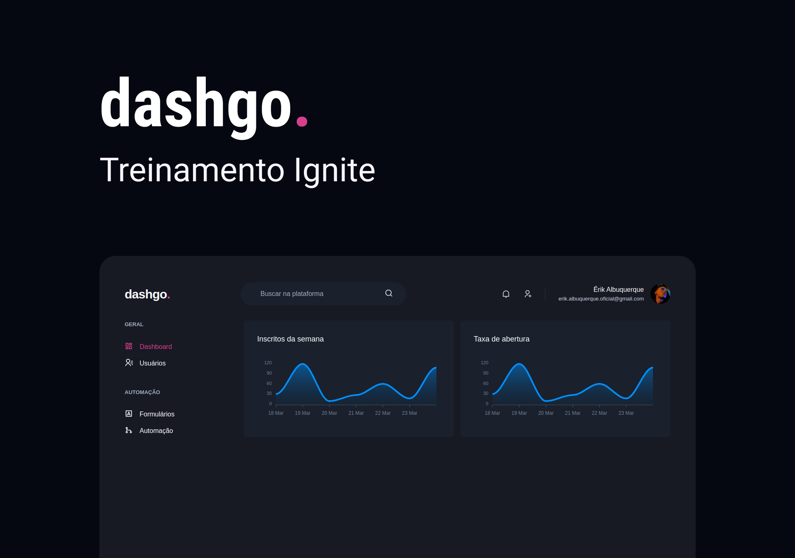
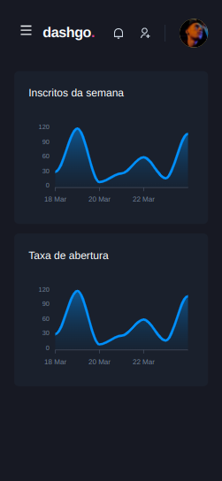
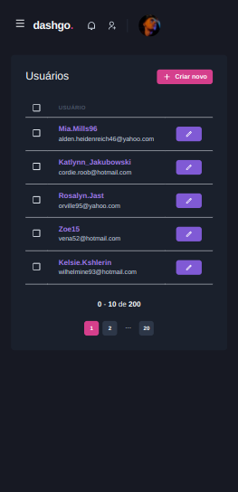
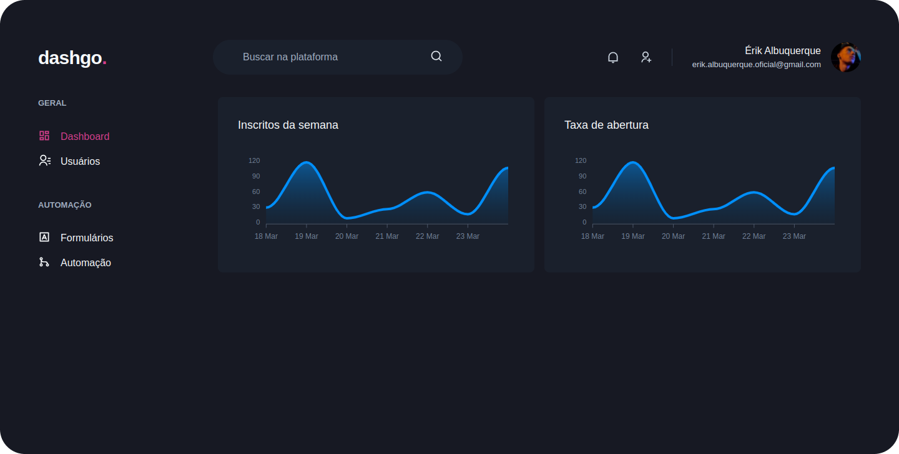
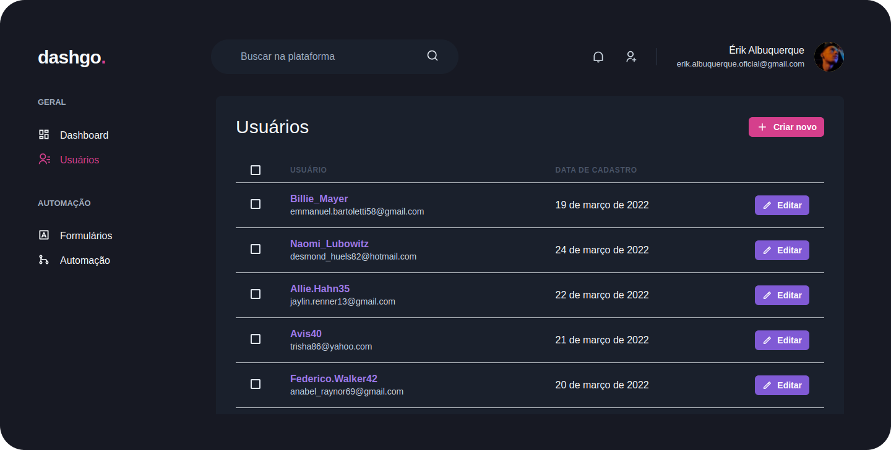

<h1 align="center" id="project_name">
  <br />
  
  <br />
</h1>

<p align="center">
Dashboard moderno para gerenciamento de usuários.
</p>

<p align="center">
  <!-- GitHub last commit -->
  <a href="https://github.com/erik-albuquerque/dashgo/commits/main">
    
  </a>
  <!-- GitHub language count -->
  
  <!-- GitHub top language -->
  
  <!-- Repository version -->
  
  <!-- Repository size -->
  
  <!-- Repository status -->
  
  <!-- Contribution -->
  
  <!-- Link repo -->
  <a href="https://github.com/erik-albuquerque/dashgo/blob/main/LICENSE.md">
    
  </a>
</p>

<p align="center">
 <a href="#about">Sobre</a> •
 <a href="#layout">Layout</a> • 
 <a href="#technologies">Tecnologias</a> • 
 <a href="#prerequisites">Pré-requisitos</a> •
 <a href="#contributors">Contribuidores</a> • 
 <a href="#author">Autor</a> • 
 <a href="#license">Licença</a>
</p>

<p align="center">
  
</p>

<h4 align="center">
  	🚧 dashgo. | Concluído 🚧
</h4>

<h2 id="about">
💻 Sobre o projeto
</h2>

dashgo. é um dashboard fictício para gerenciamento de usuários com gráficos, construído para aplicar conhecimentos de [chakra-ui](https://chakra-ui.com/), [react hook form](https://react-hook-form.com/) e [react query](https://react-query.tanstack.com/) para cache de dados.
Projeto desenvolvido durante o Ignite React da [Rocketseat](https://www.rocketseat.com.br/).

<h2 id="layout">🎨 Layout</h2>

### Mobile (Responsivo)
<p align="center">
  

  
</p>

### Web
<p align="center" style="display: flex; align-items: flex-start; justify-content: center;">
  

  
</p>

<br />
<h2 id="technologies">🛠 Tecnologias</h2>

As seguintes ferramentas foram usadas na construção do projeto:

- **[React](https://reactjs.org/)/[NextJs](https://nextjs.org/)**
- **[TypeScript](https://www.typescriptlang.org/)**
- **[Chakra UI](https://chakra-ui.com/)**
- **[Apexcharts](https://apexcharts.com/)**
- **[React Query](https://react-query.tanstack.com/)**
- **[React Hook Form](https://react-hook-form.com/)**
- **[MirageJs](https://miragejs.com/)**
- **[Axios](https://axios-http.com/)**
- **[Yup](https://github.com/jquense/yup)**

> Veja o arquivo [package.json](https://github.com/<user_do_github>/<nome_do_projeto>/package.json>)

**Utilitários**

- API: feita com **[MirageJs](https://miragejs.com/)**
- Gerador de dados fictícios: **[Faker](https://github.com/withshepherd/faker.js#readme)** by [@withshepherd](https://github.com/withshepherd)
- Formatação de datas: **[Date-fns](https://date-fns.org/)**
- Editor: **[Visual Studio Code](https://code.visualstudio.com/)**
- Ícones: **[React Icons](https://react-icons.github.io/react-icons/)**
- Fontes: **[Roboto](https://fonts.google.com/specimen/Roboto)**

<h2 id="prerequisites">💿 Como executar o projeto</h2>

### 🧰 Pré-requisitos

Antes de começar, você vai precisar ter instalado em sua máquina as seguintes ferramentas:

> [Git](https://git-scm.com), [Node.js](https://nodejs.org/en/) ou [Yarn](https://yarnpkg.com/) se for sua preferência.
> Além disto é bom ter um editor para trabalhar com o código como [VSCode](https://code.visualstudio.com/)

### 🧭 Rodando o projeto

```bash
# Clone este repositório
$ git clone https://github.com/erik-albuquerque/dashgo.git

# Acesse a pasta do projeto no terminal/cmd
$ cd dashgo

# Instale as dependências (npm ou yarn)
$ yarn

# Execute a aplicação em modo de desenvolvimento
$ yarn dev

# acesse http://localhost:3000
```

<h2 id="contributors">📫 Como contribuir para o projeto</h2>

1.  Faça um **fork** do projeto.
2.  Crie um branch: `git checkout -b <nome_branch>`.
3.  Faça suas alterações e confirme-as: `git commit -m '<mensagem_commit>'`.
4.  Envie para a branch original: `git push origin <nome_branch>`.
5.  Crie a solicitação pull.

> Como alternativa, consulte a documentação do GitHub em [como criar uma solicitação pull](https://help.github.com/en/github/collaborating-with-issues-and-pull-requests/creating-a-pull-request)

## 👨‍💻 Contribuidores

Agradecemos às seguintes pessoas que contribuíram para este projeto:

<table>
  <tr>
    <td align="center">
      <a href="#">
        <!----><br>
        <sub>
          <b></b>
        </sub>
      </a>
    </td>
  </tr>
</table>

### 🙋‍♂️ Seja um dos contribuidores

Quer fazer parte desse projeto? Clique [AQUI](CONTRIBUTING.md) e leia como contribuir.

<h2 id="author">🦸 Autor</h2>
<a href="https://github.com/erik-albuquerque">
 
 <br />
 <sub><b>Érik Albuquerque</b></sub></a>

[](https://www.linkedin.com/in/erik-albuquerque/)
[](mailto:erik.albuquerque.oficial@gmail.com)

<h2 id="license">📝 Licença</h2>

Distribuído sob a licença MIT. Veja a [LICENSE](LICENSE.md) para mais informações.

Feito com ❤️ por Érik Albuquerque 👋🏽 [Entre em contato!](https://www.linkedin.com/in/erik-albuquerque/)

[⬆ Voltar ao topo](#project_name)<br />
